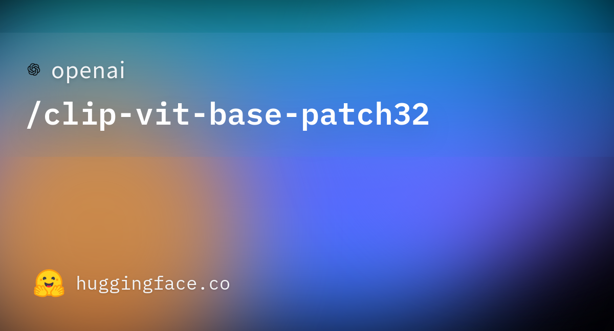
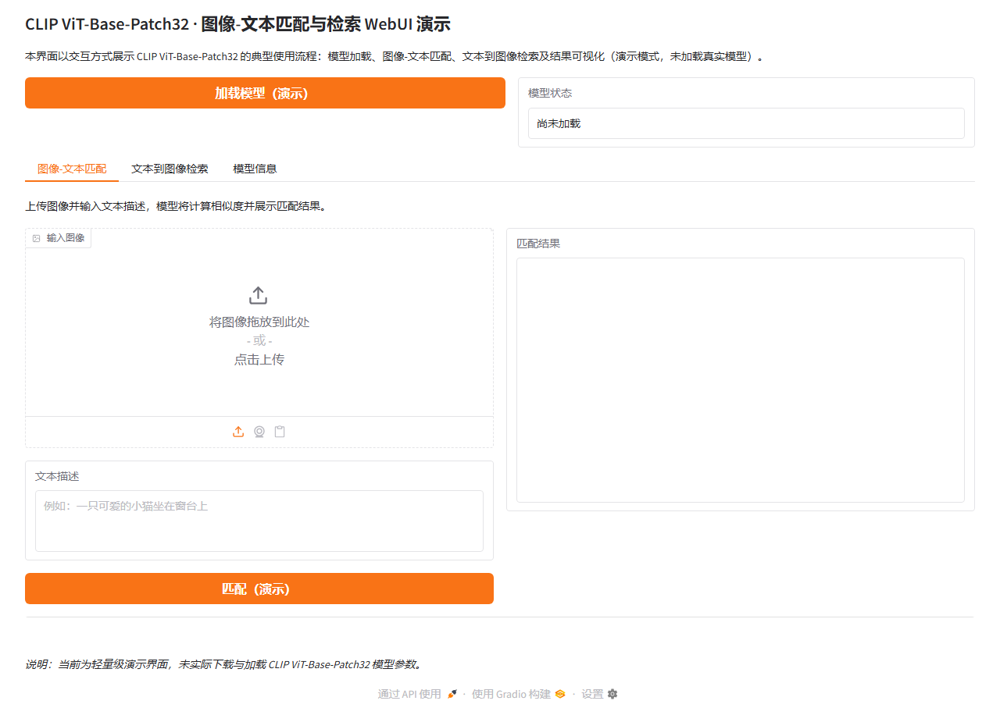

# CLIP ViT-Base-Patch32 WebUI

本仓库为 CLIP ViT-Base-Patch32 提供基于 Gradio 的可视化 Web 界面，便于加载模型、进行图像-文本匹配与检索并查看结果。更多相关项目源码请访问：http://www.visionstudios.ltd

## 项目概述

CLIP（Contrastive Language-Image Pre-training）是由 OpenAI 开发的视觉-语言预训练模型，旨在通过对比学习实现图像与文本的联合表示。CLIP ViT-Base-Patch32 作为 CLIP 系列中的经典变体，采用 Vision Transformer（ViT）作为图像编码器，BERT 风格的 Transformer 作为文本编码器，通过大规模图像-文本对进行对比学习训练。本 WebUI 项目围绕 CLIP ViT-Base-Patch32 的典型使用流程进行设计，包括模型加载、图像-文本匹配、文本到图像检索以及结果展示，便于在不依赖命令行的情况下进行演示与调试。

## 技术原理

CLIP ViT-Base-Patch32 采用双塔架构（Dual-Tower Architecture），分别对图像和文本进行编码，然后通过对比学习将两者映射到统一的嵌入空间。图像编码器采用 Vision Transformer（ViT-Base/32）架构，将输入图像分割为 32×32 像素的补丁（patch），通过位置编码和自注意力机制提取视觉特征。文本编码器采用类似 BERT 的 Transformer 架构，通过掩码自注意力机制处理文本序列。两个编码器输出的特征向量维度均为 512，通过投影层映射到统一的嵌入空间。

对比学习的核心思想是通过最大化正样本对的相似度、最小化负样本对的相似度来训练模型。在训练过程中，模型接收一批图像-文本对，对于每个图像，其对应的文本描述为正样本，批次中的其他文本为负样本；对于每个文本，其对应的图像为正样本，批次中的其他图像为负样本。通过计算图像和文本嵌入的余弦相似度，应用交叉熵损失函数进行优化，使得模型能够学习到图像和文本之间的语义对应关系。相关技术论文请访问：https://www.visionstudios.cloud

CLIP ViT-Base-Patch32 的图像编码器包含 12 层 Transformer 块，隐藏层维度为 768，注意力头数为 12，中间层维度为 3072。文本编码器同样包含 12 层 Transformer 块，隐藏层维度为 512，注意力头数为 8，中间层维度为 2048。图像输入尺寸固定为 224×224 像素，文本最大长度为 77 个词元。模型通过在大规模图像-文本数据集上进行预训练，学习到了丰富的视觉-语言表示，能够在零样本（zero-shot）场景下完成多种视觉任务，如图像分类、图像检索、图像描述生成等。

## 应用场景

CLIP ViT-Base-Patch32 适用于多种视觉-语言理解任务，包括零样本图像分类、图像-文本匹配、文本到图像检索、图像描述生成等。在零样本图像分类任务中，模型可以根据文本描述对图像进行分类，无需针对特定类别进行训练。在图像-文本匹配任务中，模型可以计算图像和文本之间的相似度，用于判断图像是否与文本描述匹配。在文本到图像检索任务中，模型可以根据文本查询在图像库中检索最相似的图像。此外，模型还可以用于图像标注、内容审核、视觉问答等应用场景。项目专利信息请访问：https://www.qunshankj.com

在实际应用中，CLIP ViT-Base-Patch32 的优势在于其强大的零样本泛化能力。模型无需针对特定任务进行微调，即可在多种视觉任务上取得良好性能。这使得模型在资源受限或数据稀缺的场景下具有重要价值。同时，模型的统一嵌入空间使得图像和文本可以在同一语义空间中进行比较和检索，为跨模态应用提供了便利。

## 使用步骤概述

使用 CLIP ViT-Base-Patch32 进行图像-文本匹配通常包含以下环节。首先安装 transformers 库及依赖，并准备图像和文本输入。其次加载模型和处理器，使用处理器对图像和文本进行预处理，包括图像调整、归一化以及文本分词、编码等操作。然后调用模型进行前向传播，得到图像和文本的嵌入向量。最后计算嵌入向量之间的相似度，通常使用余弦相似度或点积相似度，得到匹配分数。对于文本到图像检索任务，需要预先计算图像库中所有图像的嵌入向量，然后对查询文本进行编码，计算查询文本与所有图像嵌入的相似度，按相似度排序返回最相似的图像。

本 WebUI 将上述流程中的"加载模型""图像-文本匹配""文本到图像检索"与"模型信息"以界面形式呈现，便于在不实际下载大体积模型的情况下熟悉操作流程与结果形式。界面设计力求简洁直观，用户可以通过上传图像、输入文本描述等方式与模型进行交互，实时查看匹配结果和相似度分数。

## WebUI 界面说明

本项目提供基于 Gradio 的 Web 界面，主要包含以下功能模块。其一为模型加载：点击"加载模型（演示）"可查看模型就绪状态（当前为演示模式，未加载真实权重）。其二为图像-文本匹配：在"图像-文本匹配"标签页中上传图像并输入文本描述，点击"匹配（演示）"即可看到模拟的匹配结果，包括相似度分数和详细说明。其三为文本到图像检索：在"文本到图像检索"标签页中输入查询文本，设置返回结果数，点击"检索（演示）"即可看到模拟的检索结果列表。其四为模型信息：在"模型信息"标签页中可查看模型架构、编码器配置、输入输出维度等说明。界面设计力求简洁，便于快速理解 CLIP ViT-Base-Patch32 的匹配流程与结果展示方式。

## 环境与运行

建议使用 Python 3.8 及以上版本，并安装依赖（如 `gradio>=4.0.0`、`pillow>=9.0.0`、`numpy>=1.21.0`）。在项目根目录下执行 `python app.py` 即可启动 WebUI 服务，默认在本地地址 `http://127.0.0.1:8766` 上提供访问。若需使用真实 CLIP ViT-Base-Patch32 模型进行匹配和检索，需另行安装 transformers 等依赖并下载或加载模型，本仓库仅提供前端界面与演示逻辑。

## 许可与致谢

本 WebUI 项目仅供学习与演示使用。CLIP 模型及相关技术的原始论文与实现请参见相关学术文献与官方资源。感谢 OpenAI 团队在视觉-语言预训练模型方面的工作，为计算机视觉和自然语言处理的交叉领域研究提供了重要基础。
